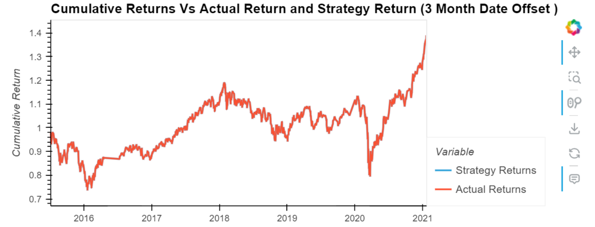
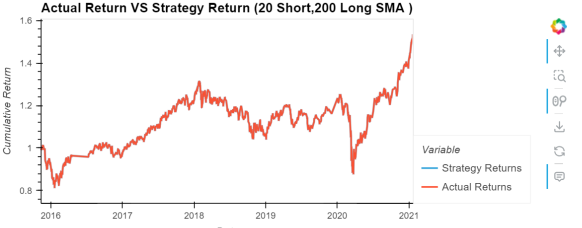
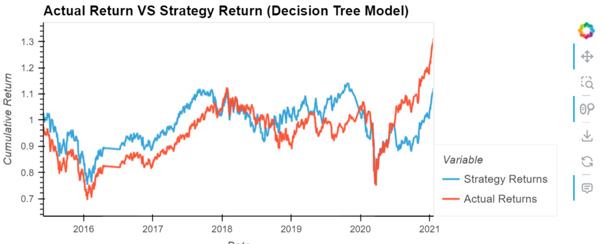

# Module-14-Challenge
In this repository you will find a .ipynb file named Machine_Learning_Trading_Bot, in this file we assume the role of a financial advisor at one of the top five financial advisory firms in the world. In recent years, my firm has heavily profited by using computer algorithms that can buy and sell faster than human traders.
The firm is planning to improve the existing algorithmic trading systems and maintain the firm’s competitive advantage in the market. Your job is to enhance the existing trading signals with machine learning algorithms that can adapt to new data.
# Part 1 Establish a Baseline Performance
Using the data provided we will use the SVC classifier model to fit the training data and make predictions based on the testing data. Review the predictions.
Review the classification report that’s associated with the SVC model predictions.
Create a predictions DataFrame that contains “Predicted”, “Actual Returns”, and “Strategy Returns” columns.
Create a cumulative return plot that shows the actual returns vs. the strategy returns. Save a PNG image of this plot. This will serve as a baseline against which to compare the effects of tuning the trading algorithm.

# Part 2 Tune the Baseline Trading Algorithm
In this section, I will adjust the model’s input features to find the parameters that result in the best trading outcomes. 
I will start by tuning the training algorithm by adjusting the size of the training dataset. I will then rerun the notebook with the updated parameters, and record the results.

#Question 1: What impact resulted from increasing or decreasing the training window?

#Answer: The effect of extending the window is a lower initial point for our returns; but, as the cycle progresses, it stabilizes until 2020 arrives. soaring to new heights and taking a knock from there, ultimately reaching 1.6, which is.2 higher than our 3-month offset. stating that the cumulative return has a positive correlation. 

#Question 2: What impact resulted from increasing or decreasing either or both of the SMA windows?

#Answer: There was not much of a change when both SMA windows were increased and decreased. This indicates that our cumulative returns are not significantly affected by the SMA window adjustments.

# Part 3 Evaluate a New Machine Learning Classifier
In this section, Using the original training data as the baseline model, il fit another model with the a new classifier.
I will then backtest the new model to evaluate its performance. Save a PNG image of the cumulative product of the actual returns vs. the strategy returns for this updated trading algorithm, and write my conclusions. 

#Question 3:  Did this new model perform better or worse than the provided baseline model? Did this new model perform better or worse than your tuned trading algorithm?

#Answer: The Decision Tree Classifier was the new model that I employed for my investigation. Regretfully, its performance was no better than that of the baseline model. Its baseline model's starting point is 1. The model's final cycle concluded with a return of 1.3, which was.3 less than the baseline model. This demonstrates that the new model is an inappropriate replacement for our approach. 

# Part 4 Create an Evaluation Report

To finish, il add a summary evaluation report at the end . I will express my final conclusions and analysis and i will support my findings by using the PNG images. 

#Summary Evaluation:

My tests revealed that the algorithm is at its best with 9 months of training data and 4 out of 100 SMA. One way to improve is to use a classifier model.  I employed a Decision Tree Classifier in my instance, and the outcomes indicate a declining strategy return that is higher than the real return.

# End of Module 14
